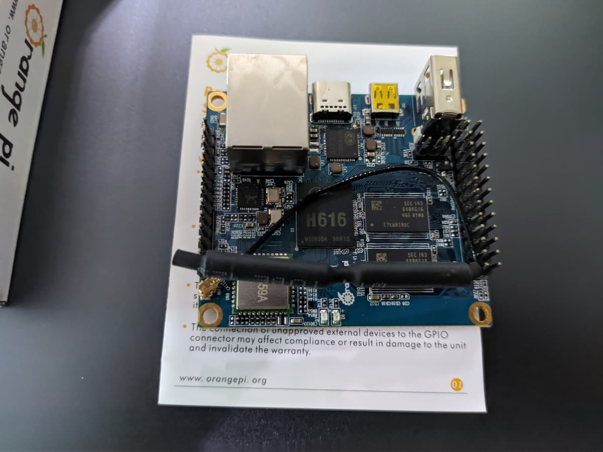
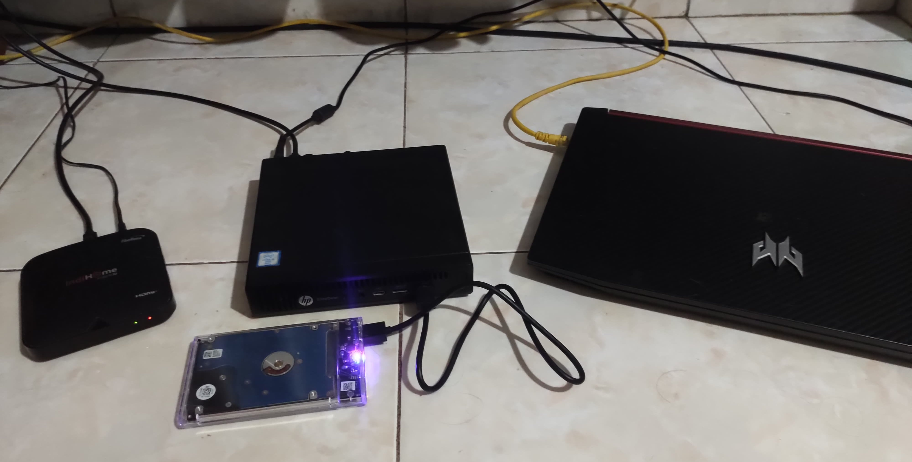
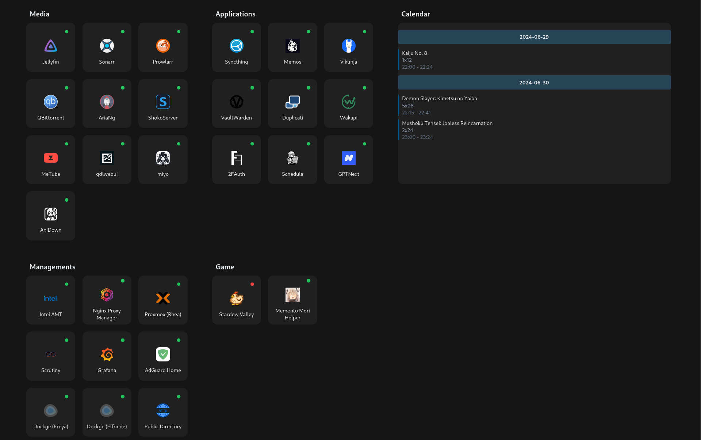

+++
title = "My Home Server Setup"
date = 2024-06-29
+++

# My First Server

Hey! This is my first blog post. I've been down the home server and self-hosted rabbit hole for 2 years now.
I started this hobby in July 2022, with [Orange Pi Zero 2](http://www.orangepi.org/html/hardWare/computerAndMicrocontrollers/details/Orange-Pi-Zero-2.html)
as my first server.

I bought Zero 2 as the alternative for Raspberry Pi 4, because it was too overpriced back then. Long story short,
in October 2022, I decided to buy a new machine for my server, that's powerful enough to host a game private server. It's one of the [TinyMiniMicro](https://www.servethehome.com/introducing-project-tinyminimicro-home-lab-revolution/) unit, an
[HP EliteDesk 800 35W G2 Mini](https://support.hp.com/us-en/product/details/hp-elitedesk-800-35w-g2-desktop-mini-pc/7633266)
I bought it used for ~189 USD on my local online store, you could probably buy it cheaper on eBay. Though it was probably overpriced, but I still think it's worth it for
me.

# My Home Server (Now)

This is what my home server looks like now. I've been using the EliteDesk unit for almost 2 years, I also reuse
my old gaming laptop as a server.

These are the specification of the machines I'm running:

- **STB HG680P**

  - OS: Armbian
  - RAM: 2GiB
  - CPU: Quad core Cortex A53
  - Storage: Built-in 8GB eMMC

- **HP EliteDesk 800 G2 Mini**

  - OS: Proxmox VE 8.2.4
  - RAM: 16GiB
  - CPU: Intel Core i5-6500T
  - Storage: 512GB NVME SSD, 128GB SATA SSD, and 1TB HDD connected with enclosure

- **Acer Nitro 5 AN515-52**

  - OS: Arch Linux
  - RAM: 8GiB
  - CPU: Intel Core i5-8300H
  - Storage: 256GB NVME SSD, 80GB HDD

With that three not-so-powerful machines, you probably wonder what I'm running. And in this post, I would like to show
you what I'm actually running on these machines.

# What is Running Inside My Server

Here is what my [self-made home server dashboard](https://github.com/veirt/vesta) looks like:

There are quite a few services, aren't there? I will explain what all of those services/applications do, starting from the top-left.

- **Media**

  - [Jellyfin](https://github.com/jellyfin/jellyfin): A media server. It provides me a nice web and applications to watch my anime. This way, I don't need to
    stream anime outside my network, and use locally provided media server and watch it from there, by using the web or
    android app that is provided. It also has [jellyfin-ani-sync](https://github.com/vosmiic/jellyfin-ani-sync) which I use to
    sync my watched episodes, to website like MyAnimeList.
  - [Sonarr](https://github.com/Sonarr/Sonarr): A PVR for shows. It automates tracking and downloading newly released seasonal anime for me and notify me via Discord when it's
    already downloaded.
  - [Prowlarr](https://github.com/Prowlarr/Prowlarr): Indexer Manager. It acts as a provider for Sonarr to download all of the '_Linux ISOs_' legally.
  - [AriaNG](https://github.com/mayswind/AriaNg): download manager. It's a web UI for the aria2 download manager.
  - [ShokoServer](https://github.com/ShokoAnime/ShokoServer): An organizer for my anime collection. Basically sorts and renames file, and provide metadata for
    Jellyfin.
  - [MeTube](https://github.com/alexta69/metube): Web UI for youtube-dl/yt-dlp. Provides an easy-to-use frontend to download a video on YouTube.
  - [gdlwebui](https://github.com/Veirt/gdlwebui): Web UI for gallery-dl. Give it a link, and it will batch download all images from that
    given link.
  - [miyo](https://github.com/veirt/miyo): Web UI for waifu2x-ncnn-vulkan and RealESRGAN-ncnn-vulkan. This will take care of upscaling an image.
  - [AniDown](https://github.com/veirt/anidown): A web that I made to download anime from a certain sites, it provides the default setting and filters that
    I want.

- **Applications**

  - [Syncthing](https://github.com/syncthing/syncthing): Continuous file synchronization. It syncs all of my phone
    photos and screenshots to my HDD.
  - [Memos](https://github.com/usememos/memos): Note taking app. I often write project ideas here that I think of here.
  - [Vikunja](https://github.com/go-vikunja/vikunja): To-do app to organize my college works.
  - [VaultWarden](https://github.com/dani-garcia/vaultwarden): Unofficial BitWarden server, a password manager.
  - [Duplicati](https://github.com/duplicati/duplicati): Backup client to backup my data to the cloud. This one has been
    unreliable at least in my use case, might change it to something else later.
  - [Wakapi](https://github.com/muety/wakapi): Self-hosted WakaTime. It provides statistics of coding related things
    like how much time I spent on a project, what languages I write the most.
  - [2FAuth](https://github.com/Bubka/2FAuth): You might know Google Authenticator, this is a kind of web version of
    that. There's always a time I need to make 2FA, and my phone is not by my side.
  - [Schedula](https://github.com/veirt/schedula): Web to manage my college schedule. This is integrated with a WhatsApp
    Bot to send a notification 30 minutes before the class starts.
  - [GPTNext/NextChat](https://github.com/ChatGPTNextWeb/ChatGPT-Next-Web): An alternative web for ChatGPT. Since it's hosted
    locally, it's really fast to access.

- **Managements**

  - [Intel AMT](https://www.intel.com/content/www/us/en/privacy/intel-active-technology-vpro.html): Intel® Active Management Technology. My HP EliteDesk comes with vPro and this is the remote management
    website that it provides.
  - [Nginx Proxy Manager](https://github.com/NginxProxyManager/nginx-proxy-manager): A web UI for the nginx. I use this
    to access of all my services with a domain, without putting its port.
  - [Proxmox](https://www.proxmox.com/en/): Web UI that Proxmox provides to make virtual machines or containers.
  - [Scrutiny](https://github.com/AnalogJ/scrutiny): Monitor my hard drives and provides frontend with a nice graph for
    it. It can also be configured to notify if there is something wrong with your HDD or SSD.
  - [Grafana](https://github.com/grafana/grafana): Provides a nice graph of my machines that are configured with
    [node_exporter](https://github.com/prometheus/node_exporter).
  - [AdGuard Home](https://github.com/AdguardTeam/AdGuardHome): A DNS server that acts as a network-level ad-blocker.
  - [Dockge](https://github.com/louislam/dockge): I use docker compose on almost all my self-hosted applications. This
    gives me a nice web to view the logs of the docker container.
  - Public Directory: Public HTTP server that my friends and I use to quickly share stuffs. It uses [darkhttpd](https://github.com/emikulic/darkhttpd).

- **Game**
  - [Stardew Valley](https://github.com/norimicry/stardew-multiplayer-docker): Headless Stardew Valley client that acts
    as a server.
  - [Memento Mori Helper](https://github.com/moonheart/mementomori-helper): There is nothing to explain here.

# Conclusion

Setting up and maintaining a home server is really fun. At first, I only started because I want to host a game server. But, starting with
Pi-Hole, I started looking for self-hosted applications that might be useful. There was also a time when I scrolled
through the [awesome-selfhosted](https://github.com/awesome-selfhosted/awesome-selfhosted) just to find a useful app for
me. I found myself searching for solutions to problems I didn't even have yet.

Having home server also drives my passion to make applications that I actually use.
Since I have a machine that is always on (almost), I don't need to find a VPS to host all of my stuff.

If you've read this far, I hope this post has given you ideas about what you can do with a home server, or at least
provided some insight into the world of self-hosting.

Thank you, have a nice day.
